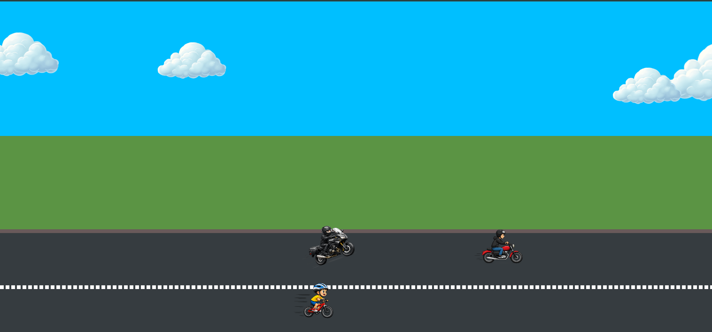

# 🏍️ CSS Transitions & Animations Showcase

A fun and responsive animation project built with **HTML5** and **CSS3**. This project demonstrates the power of CSS animations by creating an animated road scene with moving bikes and drifting clouds.

## 🚀 Live Demo

https://usmanpersonalmail2025-spec.github.io/Transitions-Magic/

## 📸 Preview



---

## ✨ Features

- ☁️ Infinite moving clouds
- 🏍️ Multiple animated bikes
- 🛣️ Animated road with dashed lane divider
- 🎡 Custom CSS keyframe animations
- 📱 Responsive layout
- ⚡ Pure HTML & CSS (No JavaScript)

---

## 🛠️ Built With

- HTML5
- CSS3
- CSS Animations
- CSS Transforms
- CSS Keyframes

---

## 📂 Project Structure

```
Transitions-Magic/
│
├── images/
│   ├── bike1.png
│   ├── bike2.png
│   ├── bike3.png
│   └── cloud2.png
│
├── index.html
├── styles.css
└── README.md
```

---

## 🎯 CSS Concepts Practiced

- CSS Animations
- @keyframes
- Transform
- Translate
- Rotate
- Positioning
- Animation Timing Functions
- Infinite Animations
- Linear Motion
- Responsive Units (vw)

---

## 📖 Animation Details

### ☁️ Clouds

- Multiple clouds move continuously across the sky.
- Different animation durations create a natural effect.

### 🏍️ Bikes

Three different bikes are animated:

- **Bike 1** → Constant speed
- **Bike 2** → Slower movement
- **Bike 3** → Performs a wheelie while moving

### 🛣️ Road

- Dashed center line
- Road borders
- Continuous vehicle movement

---

## ▶️ Getting Started

Clone the repository:

```bash
git clone https://github.com/your-username/Transitions-Magic.git
```

Open the project folder:

```bash
cd Transitions-Magic
```

Open `index.html` in your browser.

---

## 📚 What I Learned

While building this project, I practiced:

- Creating smooth CSS animations
- Working with multiple keyframes
- Combining transforms
- Positioning animated elements
- Responsive animation using viewport units
- Organizing CSS for maintainability

---

## 💡 Future Improvements

- Add day/night mode
- Add mountains and trees
- Add moving sun and moon
- Add traffic lights
- Add more vehicles
- Add JavaScript controls
- Add sound effects

---

## 👨‍💻 Author

**Usman Khan**

GitHub: https://github.com/usmanpersonalmail2025-spec

---

## ⭐ Support

If you enjoyed this project, consider giving it a ⭐ on GitHub.
